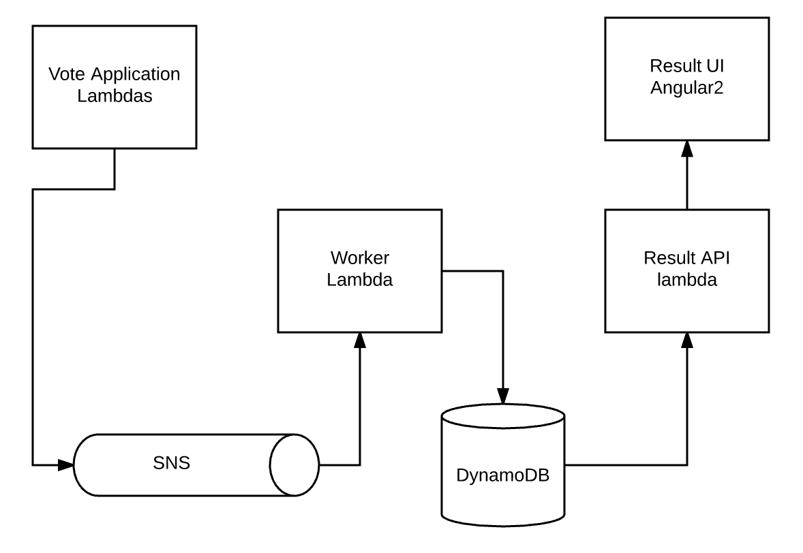

# Serverless Voting application in AWS

Heavily inspired on https://github.com/docker/example-voting-app
Uses https://github.com/serverless/serverless for deployment

### Getting started 

Install [Serverless](https://serverless.com/framework/docs/providers/aws/guide/installation/)

Make sure you have AWS credentials with permissions to CRUD on : 

* Cloudformation
* Lambda
* SNS
* Dynamodb

//TODO make this fancier
Install node_modules for the 3 apps by running `npm install` in each of them

Run `serverless deploy` at the root

Run `ng build` in result/result-ui and deploy the content of the `dist` folder somewhere publicly accessible ( S3 would work, but I use [netlify](https://www.netlify.com/))

### Architecture

result : a Node.js lambda to display stats from dynamodb  

vote : a couple of Node.js lambdas to cast a vote to an SNS topic

worker : a Node.js lambda which consumes event from the SNS topic and stores the vote in DynamoDB

